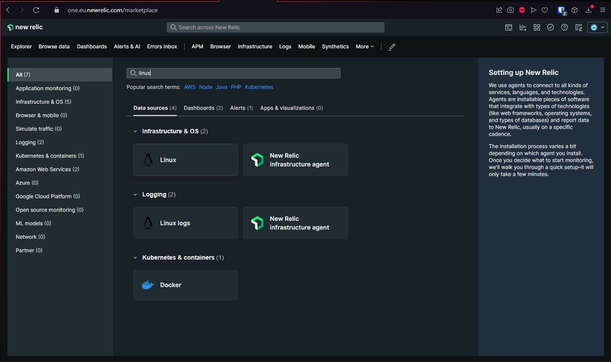
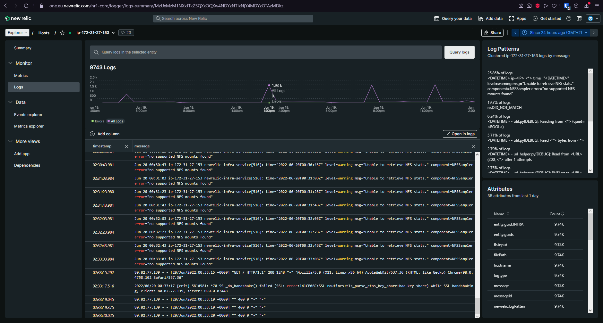
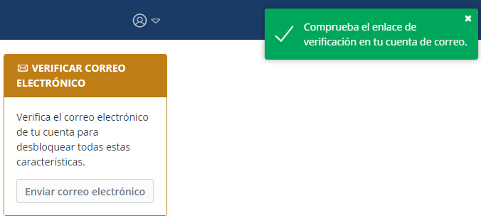
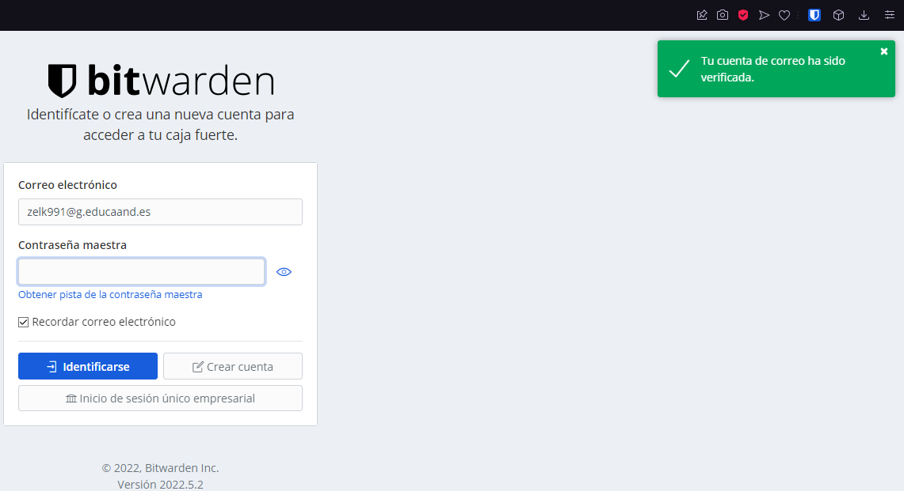
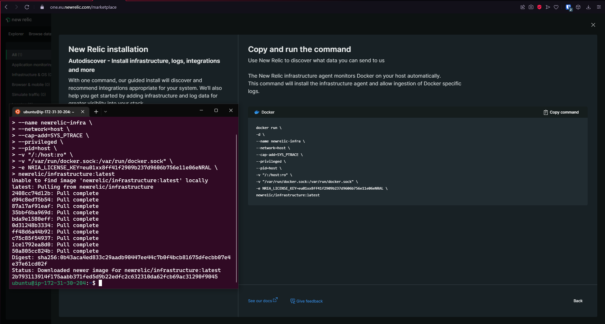
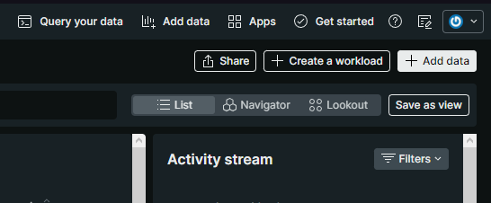

# PROYECTO FIN DE CURSO ASIR ZAKARIYA EL KHATTABI

# New Relic Herramienta de Monitorización y Medición de Rendimiento de Infraestructura de Servicios.
````
 _   _ _______        __   ____  _____ _     ___ ____
| \ | | ____\ \      / /  |  _ \| ____| |   |_ _/ ___|
|  \| |  _|  \ \ /\ / /   | |_) |  _| | |    | | |
| |\  | |___  \ V  V /    |  _ <| |___| |___ | | |___
|_| \_|_____|  \_/\_/     |_| \_\_____|_____|___\____|
````

## ¿Qué es New Relic?
---


__New Relic__ es un complejo sistema de monitorización del rendimiento de una infraestructura de servicios, desde backend hasta frontend, monitorización del rendimiento de navegadores, APIs, servidores, aplicaciones móviles.

Se puede definir en que es una herramienta de monitorización del volumen total y en tiempo real de los recursos de una o varias máquinas. La compañía tiene integrado funcionalidades similares para medir el rendimiento de aplicaciones móviles para los dos entornos.

### ¿Qué podemos hacer con New Relic?
---
New Relic es una herramienta de monitorización bastante transversal. Estos son algunos de los aspectos más interesantes que suelen medir la plataforma:

Por la parte de datos de experiencia de cliente: comportamiento de los usuarios, rendimiento de las aplicaciones móviles, navegadores y servidores.
Por la parte de datos de negocio: todos los aspectos anteriores, más el rendimiento de los recursos en la nube pública, microservicios, APIs y bases de datos, tanto SQL como NoSQL.


+ Algunas de las tareas que es capaz de realizar el software:
    - Monitorizar Conexiones Web (tiempos de respuesta, n.º de peticiones, carga, etc..)
    - Monitorización de Log de Errores (Sistema de aviso por correo si hay fallos de conexión, etc..)
    - Fijar alertas sobre datos de referencia (tiempos de respuesta, errores de autenticación, etc..)
    - Estadísticas de rendimiento	en distintos dispositivos (uso de memoria, velocidad de respuesta, etc..)

+ Permite monitorizar varios sistemas de lenguaje de aplicaciones web entre ellos están los siguientes:
    - .NET
    - Java
    - PHP
    - Python
    - Ruby

+ Permite monitorizar el trafico que entra por los navegadores por el sistema de Browsers.

+ Es capaz de Monitorizar en tiempo real, casi todos los servicios que ofrece.

## ¿Cómo implementar New Relic en mi sistema Ubuntu?
---
Primero hay que crear una cuenta en [New Relic](https://newrelic.com).


Una vez registrado se podrá acceder a la plataforma. Una vez en la plataforma podremos ver muchas cosas, lo que interesa ahora mismo es crear un nuevo host para poder monitorizar nuestro sistema operativo.

1. Pinchar en __"+ Add data"__.


2. Buscar el sistema que se quiera monitorizar.


3. Seleccionar Lunix y pinchar en __"Begin installation"__.


4. Copiar el Comando que nos proporciona New Relic con nuestras ID y Key de nuestra cuenta y pegarlo en nuestro sistema para que haga conexión y empiece la instalación.


5. Una vez ejecutado el comando solo hace falta esperar para que termine la conexión y la instalación del agente.


6. Una vez termina, si el agente detecta que hay algun software que se pueda monitorizar con New Relic va a hacer una recomendación de la instalación del agente del software detectado.


7. Una vez terminado todo el proceso, nos situamos en el inicio de la plataforma de new relic y se vera como hay un nuevo host en la plataforma. Podremos observar como ya esta recolectando datos de nuestro host.


8. Podemos observar todo el sistema de Logs que tiene el host de una forma centralizada.


9. Nos permite ver los eventos que tiene el sistema y personalizarlos (para ello debemos tener más conocimentos sobre las consultas que se puedan hacer para personalizarlas a nuestro gusto).


# Implementar New Relic en Bitwarden Server.

## ¿Qué es Bitwarden?
---
Es un Gestor de contraseñas muy seguro que nos permite guardar todas nuestras contraseñas de todos los servicios que usemos sin la necesidad de acordarnos de todas las contraseñas si no solo de una que es la que nos permite abrir la caja fuerte de todas nuestras contraseñas. Si se pierde la contraseña principal ya nos podemos despedir de las demás porque son irrecuperables totalmente.

### Instalación de Bitwarden:

Tenemos una Guía de Instalación en la página principal de [Bitwarden](https://bitwarden.com/help/install-on-premise-linux/).

1. Primero hay que tener docker y docker-compose instalados en nuestro sistema. Para ello yo uso mi escript para instalar Docker en mis sistemas. [SCRIPTDOCKER](https://github.com/legofzhak/scriptdocker).

    ```
    #!/bin/bash
    set -x

    # Variables (CAMBIAR USUARIO)
    USERNAME=ubuntu

    # Actualizamos el sistema
    apt update

    # Descargamos el script de instalación
    curl -fsSL https://get.docker.com -o get-docker.sh

    # Ejecutamos el script
    sh get-docker.sh

    # Añadimos nuestro usuario al grupo docker
    usermod -aG docker $USERNAME

    # Iniciamos el servicio docker
    systemctl start docker

    # Configuramos para que el servicio se inicie automaticamente
    systemctl enable docker

    # Instalar Docker Compose
    apt install docker-compose -y

    # Actualizamos el grupo docker se hace fuera del script
    #newgrp docker
    ```

2. Descargamos el script de instalación de Bitwarden y le damos permisos de ejecución.
    ```
    curl -Lso bitwarden.sh https://go.btwrdn.co/bw-sh
    chmod +x bitwarden.sh
    ```

3. Ejecutamos el script indicando que queremos instalarlo con el siguiente comando. Nos pedirá el dominio y si queremos generar los certificados ssl, y por final el correo donde se te va ha avisar de que se te van a caducar los certificados SSL.

    ```shell
    ubuntu@ip-172-31-86-128:/opt/bitwarden$ ./bitwarden.sh install
    _     _ _                         _
    | |__ (_) |___      ____ _ _ __ __| | ___ _ __
    | '_ \| | __\ \ /\ / / _` | '__/ _` |/ _ \ '_ \
    | |_) | | |_ \ V  V / (_| | | | (_| |  __/ | | |
    |_.__/|_|\__| \_/\_/ \__,_|_|  \__,_|\___|_| |_|

    Open source password management solutions
    Copyright 2015-2022, 8bit Solutions LLC
    https://bitwarden.com, https://github.com/bitwarden

    ===================================================

    bitwarden.sh version 2022.5.1
    Docker version 20.10.17, build 100c701
    docker-compose version 1.25.0, build unknown

    (!) Enter the domain name for your Bitwarden instance (ex. bitwarden.example.com): bitserver-zaka.ddns.net

    (!) Do you want to use Let's Encrypt to generate a free SSL certificate? (y/n): y

    (!) Enter your email address (Let's Encrypt will send you certificate expiration reminders): zakariyasmr1920@gmail.com
    ```

    Una vez genere los certificados SSl le va a preguntar sobre el nombre que le quiera dar a la base de datos de Bitwarden.

    ```shell
    - - - - - - - - - - - - - - - - - - - - - - - - - - - - - - - - - - - - - - - -
    If you like Certbot, please consider supporting our work by:
    * Donating to ISRG / Let's Encrypt:   https://letsencrypt.org/donate
    * Donating to EFF:                    https://eff.org/donate-le
    - - - - - - - - - - - - - - - - - - - - - - - - - - - - - - - - - - - - - - - -
    (!) Enter the database name for your Bitwarden instance (ex. vault): bitdb
    ```

    Una vez creada la base de datos le va a pedir la instalacion ID y el KEY para ello hay que entar en https://bitwarden.com/host. Deberá poner su correo electronico.
    

    Y despues recibira sus credenciales de instalación.
    


    ```shell
    (!) Enter your installation id (get at https://bitwarden.com/host): dd6c8931-6197-4766-8b8c-aeb900349b3e

    (!) Enter your installation key: 6BCZnr1l4FcpM1U6pMQG

    Generating DH parameters, 2048 bit long safe prime, generator 2
    This is going to take a long time
    ```

4. Una vez instalado el servidor Bitwarden. Ejecutamos un "updateself" y despues un "update".

    ```shell
    ubuntu@ip-172-31-86-128:/opt/bitwarden$ ./bitwarden.sh updateself
    _     _ _                         _
    | |__ (_) |___      ____ _ _ __ __| | ___ _ __
    | '_ \| | __\ \ /\ / / _` | '__/ _` |/ _ \ '_ \
    | |_) | | |_ \ V  V / (_| | | | (_| |  __/ | | |
    |_.__/|_|\__| \_/\_/ \__,_|_|  \__,_|\___|_| |_|

    Open source password management solutions
    Copyright 2015-2022, 8bit Solutions LLC
    https://bitwarden.com, https://github.com/bitwarden

    ===================================================

    bitwarden.sh version 2022.5.1
    Docker version 20.10.17, build 100c701
    docker-compose version 1.25.0, build unknown

    Updated self.
    ```

    ```shell
    ubuntu@ip-172-31-30-115:~$ ./bitwarden.sh update
    _     _ _                         _
    | |__ (_) |___      ____ _ _ __ __| | ___ _ __
    | '_ \| | __\ \ /\ / / _` | '__/ _` |/ _ \ '_ \
    | |_) | | |_ \ V  V / (_| | | | (_| |  __/ | | |
    |_.__/|_|\__| \_/\_/ \__,_|_|  \__,_|\___|_| |_|

    Open source password management solutions
    Copyright 2015-2022, 8bit Solutions LLC
    https://bitwarden.com, https://github.com/bitwarden
    ```

5. Para que nos funcione bien Bitwarden se debera configurar un servidor de reenvio SMTP en la siguiente ruta. `./bwdata/env/global.override.env`

    Para ello yo uso el servicio de [Mailgun](https://www.mailgun.com) que nos proporciona el servicio de reenvio SMTP gratuito. 
    

6. Editamos el fichero `./bwdata/env/global.override.env` solo las variables de SMTP añadiendo el host de smtp de mailgun, el usuario y la contraseña que nos proporciona.

    

    ````
    globalSettings__mail__replyToEmail=no-reply@bitserver-zaka.ddns.net
    globalSettings__mail__smtp__host=smtp.mailgun.org
    globalSettings__mail__smtp__port=587
    globalSettings__mail__smtp__ssl=false
    globalSettings__mail__smtp__username=postmaster@sandboxb0acd32b8679427e87404f6a213dd514.mailgun.org
    globalSettings__mail__smtp__password=0fcded10a992f31f551f3e2486c20be2-50f43e91-2752edb1
    ````

7. Una terminada la configuración, reiniciamos el servidor Bitwarden.

    ```shell
    ubuntu@ip-172-31-86-128:/opt/bitwarden$ ./bitwarden.sh restart
    _     _ _                         _
    | |__ (_) |___      ____ _ _ __ __| | ___ _ __
    | '_ \| | __\ \ /\ / / _` | '__/ _` |/ _ \ '_ \
    | |_) | | |_ \ V  V / (_| | | | (_| |  __/ | | |
    |_.__/|_|\__| \_/\_/ \__,_|_|  \__,_|\___|_| |_|

    Open source password management solutions
    Copyright 2015-2022, 8bit Solutions LLC
    https://bitwarden.com, https://github.com/bitwarden

    ===================================================

    bitwarden.sh version 2022.5.1
    Docker version 20.10.17, build 100c701
    docker-compose version 1.25.0, build unknown

    Stopping bitwarden-nginx         ... done
    Stopping bitwarden-admin         ... done
    Stopping bitwarden-mssql         ... done
    Stopping bitwarden-icons         ... done
    Stopping bitwarden-attachments   ... done
    Stopping bitwarden-sso           ... done
    Stopping bitwarden-notifications ... done
    Stopping bitwarden-api           ... done
    Stopping bitwarden-events        ... done
    Stopping bitwarden-web           ... done
    Stopping bitwarden-identity      ... done
    Removing bitwarden-nginx         ... done
    Removing bitwarden-admin         ... done
    Removing bitwarden-mssql         ... done
    Removing bitwarden-icons         ... done
    Removing bitwarden-attachments   ... done
    Removing bitwarden-sso           ... done
    Removing bitwarden-notifications ... done
    Removing bitwarden-api           ... done
    Removing bitwarden-events        ... done
    Removing bitwarden-web           ... done
    Removing bitwarden-identity      ... done
    ```

8. Ahora entramos en nuestro servidor Bitwarden.

    

    Debemos registrarnos o crear nueva cuenta.
    

    Una vez registrados accedemos a la plataforma de Bitwarden. Y pinchamos en enviar correo electrónico de verficación para poder usar todas las utilidades de bitwareden en nuestra cuenta.
    
    
    Si tenemos toda la configuración bien nos saldra un mensaje en verde de que se ha enviado el correo para que se pueda verificar.
    

    Verificamos el correo.
    

    Y por último se termina la configuración de Bitwarden ya esta listo para un uso local seguro y se pueden cambiar los puertos para asegurlarlo mas si hay necesidad de que salga por internet. (Nota: Yo estoy usando NoIP como un Nombre de Dominio DNS gratuito.)
    

## Instalación de Agente de New Relic en el servidor donde esta alojado Bitwarden.

1. Entramos en New Relic y añadimos un nuevo host Linux.


2. Copiamos el comando y lo ejecutamos en nuestro servidor Bitwarden.


3. Una vez instalado y conectado, como tenemos Bitwarden con Docker debemos ejecutar el servicio de Docker de New relic.


4. Buscamos Docker y ejecutamos el comando que nos proporciona.

    
5. Tras ejecutar el comando se iniciara el contenedor docker de New Relic para que pueda monitorizar todos mis contenedores docker.


6. Una vez terminado podremos observar que ahora podemos ver los contenedores docker que tenemos de bitwarden.


7. Para centralizar el Host y los contenedores en un solo lugar crearemos un Workload, con los contenedores y el host donde se estan ejecutando. Para ello pinchamos en "+ Create Workload".


8. Seleccionaremos los contenedores de Bitwarden y el Host correcto de Bitwarden.


9. Entramos al Workload y podremos ver que se ven los datos de los contenedores y del Host centralizado.


10. Podemos pinchar en "Map" y veremos como es capaz de tener un mapa del sistema que tenemos montado.


11. De esta forma podemos tener Monitorizado nuestro Servidor Bitwarden de forma centralizada.


## Monitorización de mi Pagina Web En PHP.
La Página Web consiste en una simulación de una pequeña tienda virtual programada en PHP/HTML con una pequeña base de datos(no es mía). Esta implementada en una Pila LAMP con docker y Docker Compose. Puedes observar el codigo empleado en el repositorio [Proyecto-ASIR](https://github.com/legofzhak/Proyecto-ASIR)


## Monitorizar Página Web en PHP Con Docker.

1. Como esta implementada con docker haremos los mismos pasos que hicimos con Bitwarden. Primero ejecutamos el Agente del Host Linux de New Relic donde esta desplegado la Página Web.

Nota: El agente de Apache no va a funcionar en esta maquina ya que no esta localmente si no en una imagen docker.

2. Ejecutamos el Agente de Docker de New Relic en nuestra maquina de la Pagina Web PHP.


3. Creamos un Workload del Proyecto en PHP con los contenedores necesarios y el host donde estan desplegados los contenedores.


4. Y ya tenemos nuestros contenedores y Host monitorizados de una manera centraliada.


## Monitorizar el tráfico de nuestra web.

Gracias al sistema que nos proporciona New Relic con Browser monitoring. Nos proporciona un simple script que podemos pegar en nuestra página Web y en unos minutos ya estamos monitorizando el trafico que tiene nuesta Web.


1. Pinchamos en Browser Monitoring, y seleccionis el modo __Copy/Paste__ Javascript code.


2. Dejamos las "instrumentation" por defecto. Seleccionamos que no esta la app y le damos un nombre a nuestra App. 


3. Nos proporcionara un script que debemos pegar en nuestro index.php 


4. Lo pegamos en el HEAD de nuesto index.


5. Accedemos de nuevo a New Relic y entramos en Browser y pinchamos en el nombre de nuestra App, al cabo de unos minutos cuando generemos trafico de varios sitios empezará a mostrar datos.


    No se puede observar todos los servicios pero nos puede mostrar demasiado con tanta sensillez.
   


## Monitorización de Github Pages con New Relic.

Aplicando la Monitorización de Browser de New Relic podemos monitorizar el tráfico de nuestra Web alojada en Github.

1. Creamos una nueva App Browser en New Relic y copiamos el Script.


2. Pegamos el Script en nuestro Index alojado en Github.


3. Esperamos unos minutos mientras generamos trafico y veremos que empiezan a entrar datos de nuestra App.


## Sistema de Logs New Relic

New Relic nos permite ver todos los logs que tienen todos nuestros sistemas a la vez eso nos permite ver si hay algun problema sin estar buscando en que maquina o servicio a sido.


Pinchando en un Log podremos ver todos los detalles de que es, a que servicio pertenece y de que se trata.


